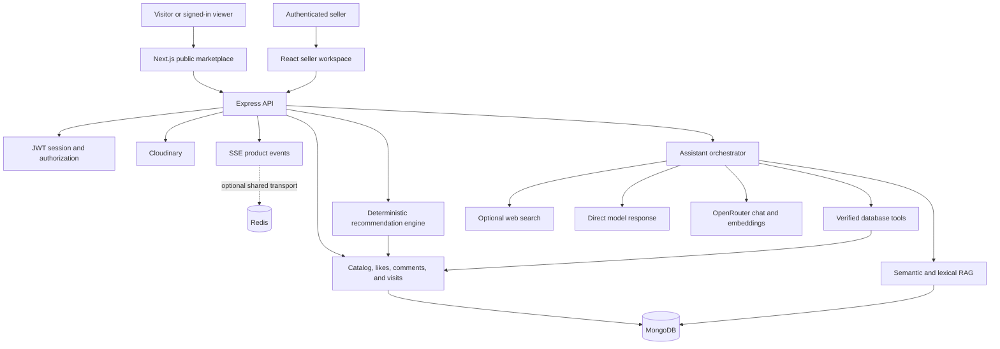
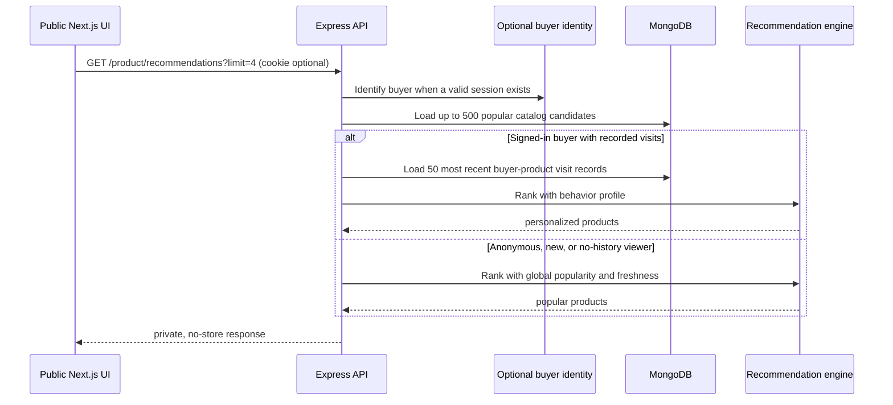
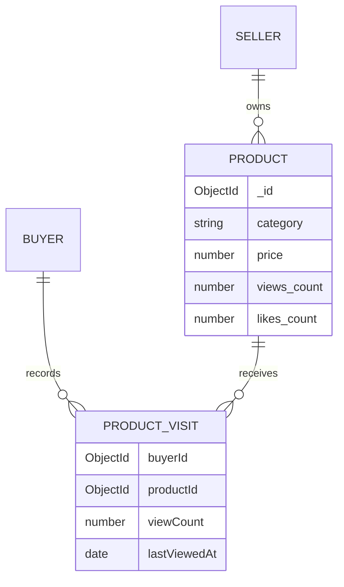

# ElectraMarket AI architecture

ElectraMarket AI is a non-transactional product-listing marketplace. The public application discovers listings and contacts owners directly; the seller application manages listings; the backend owns authentication, data integrity, recommendations, real-time events, media integration, and AI orchestration.

## System context

The recommendation engine and assistant are deliberately separate. Recommendations are calculated from verified MongoDB data and do not need an LLM. The assistant can therefore fail or be rate-limited without disabling the homepage recommendation experience.

## Recommendation request flow

Opening a product calls `POST /product/view/:id`. Every valid request atomically increases the product's global view total. When a valid buyer session is present, the API also upserts that buyer's `ProductVisit` record, increases its frequency, and updates its latest-visit timestamp.

## Recommendation ranking

### New-user strategy

The `popular` strategy uses:

| Signal | Contribution |
| --- | ---: |
| Log-normalized product views | 59.5% |
| Log-normalized likes | 25.5% |
| Listing freshness | 15% |

Log normalization prevents one highly viewed listing from permanently overwhelming the rest of the catalog. Freshness decays gradually so newer listings can enter the result.

### Returning-viewer strategy

The `personalized` strategy builds a recency-and-frequency-weighted profile from visited products and scores candidates with:

| Signal | Weight |
| --- | ---: |
| Category affinity | 36% |
| Product name, model, category, and specification terms | 22% |
| Price affinity | 17% |
| Global popularity | 15% |
| Listing freshness | 10% |

Visit influence decays over time. Frequently revisited products contribute more, while candidates already seen by the buyer receive a `0.72` novelty multiplier. This permits useful revisits without allowing browsing history to fill the entire recommendation row.

## Recommendation data model

`ProductVisit` has a unique compound index on `buyerId + productId` and an index on `buyerId + lastViewedAt`. Products have a compound popularity index led by `views.count`. The buyer ID is always taken from the verified JWT session rather than request data.

## Cache and privacy boundaries

- Catalog, category, and public product-detail GET responses may use short public caching.
- `GET /product/recommendations` always sends `Cache-Control: private, no-store`, even for anonymous fallback results, because the same route can return personalized content.
- Visit documents and buyer identifiers are never serialized into recommendation responses.
- Invalid or expired buyer cookies are treated as anonymous for read-only recommendations.
- Recommendation failures do not block catalog browsing; the client simply omits the section content.

## Scaling path

The current implementation intentionally favors operational simplicity for a small-to-medium catalog:

- It ranks at most 500 pre-sorted product candidates per request.
- It reads at most the viewer's 50 most recent product relationships.
- Ranking is in-process and requires no paid model or vector store.
- MongoDB atomic updates make visit tracking safe across multiple stateless API replicas.

When the catalog or traffic grows, keep the public API contract and progressively replace internals:

1. Cache anonymous popularity results for a short interval on a separate public endpoint.
2. Precompute category popularity and user-profile summaries in scheduled jobs.
3. Retrieve a bounded candidate set with MongoDB aggregation or Atlas Vector Search before ranking.
4. Store short-lived personalized result IDs in Redis when repeated calculation becomes measurable.
5. Add share and owner-contact events as stronger intent signals after consent and retention policies are defined.

Do not introduce an LLM into the ranking loop. The chatbot may eventually call the recommendation API as a verified function tool, but ranking should remain deterministic, observable, and available independently of OpenRouter.
