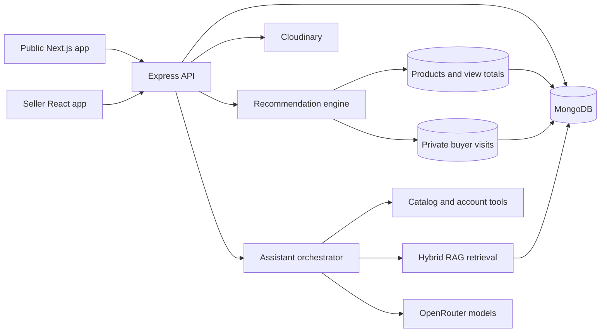

# ElectraMarket AI

ElectraMarket AI is a mobile-first electronics listing marketplace with an AI shopping assistant. Sellers publish and manage products while visitors discover listings, inspect seller contact details, share products, and participate through likes and comments.

This is intentionally a **non-transactional marketplace**. It does not provide carts, checkout, payments, shipping, or order processing. Interested buyers contact the product owner directly.

## What the platform provides

### Public marketplace

- Responsive product discovery for mobile, tablet, and desktop
- Search, category and price filtering, sorting, and pagination
- Detailed product specifications and image galleries
- Public seller name, phone number, address, and rating
- Shareable product links and social sharing
- Likes counted once per authenticated viewer
- Publicly readable comments, with writing restricted to signed-in viewers
- Most-viewed discovery for anonymous visitors and behavior-based recommendations for returning viewers
- Persistent light and dark themes

### Seller workspace

- Secure seller authentication
- Seller-owned product isolation: each seller sees and modifies only their listings
- Create, edit, and delete listing workflows
- Live analytics for listings, views, likes, and comments
- Public seller-profile management
- Responsive light and dark admin themes

### AI assistant

- OpenRouter-based LLM integration
- LLM-directed routing between function tools, RAG, web search, and direct answers
- Live catalog search and product-detail tools
- Authenticated account lookup and explicit like/comment actions
- Hybrid semantic and lexical knowledge retrieval
- Automatic product-index synchronization
- Graceful fallback when a model, embedding provider, or tool is unavailable

## Architecture



| Application | Purpose | Default development URL |
| --- | --- | --- |
| `clientFrontend` | Public marketplace and chatbot | `http://localhost:3000` |
| `adminFrontend` | Seller dashboard and listing management | `http://localhost:3001` |
| `backend` | REST API, authentication, database, media, and AI orchestration | `http://localhost:4500` |

## Technology stack

- Next.js 16, React 19, Zustand, Bootstrap, and Lucide icons
- Node.js, Express, Mongoose, JWT, bcrypt, and Nodemailer
- MongoDB for application data, recommendation signals, and RAG chunks
- Cloudinary for product images
- OpenRouter for chat completions, function selection, embeddings, and optional web search

## Repository structure

```text
ElectraMarket-AI/
├── clientFrontend/    Public marketplace UI
├── adminFrontend/     Seller administration UI
├── backend/           API, authentication, product logic, and AI services
├── ARCHITECTURE.md    System flows, data boundaries, and scaling notes
├── DEPLOYMENT.md      Production topology and operating checklist
└── README.md
```

## Local setup

### Prerequisites

- Node.js 20 or newer
- npm
- MongoDB running locally or a MongoDB connection string
- Cloudinary credentials for image uploads
- An OpenRouter API key for AI features

### 1. Configure the backend

Copy `backend/.env.example` to `backend/.env`, then provide the required values:

```env
PORT=4500
NODE_ENV=development
CLIENT_ORIGINS=http://localhost:3000,http://localhost:3001
MONGODB_URI=mongodb://127.0.0.1:27017/electrastore
MONGODB_MAX_POOL_SIZE=20
MONGODB_MIN_POOL_SIZE=2
JWT_SECRET=replace-with-a-long-random-secret
REDIS_URL=redis://localhost:6379
FRONTEND_REVALIDATE_URL=http://localhost:3000/api/revalidate
REVALIDATE_SECRET=replace-with-a-long-random-secret

CLOUDINARY_NAME=your-cloudinary-name
CLOUDINARY_API_KEY=your-cloudinary-key
CLOUDINARY_API_SECRET=your-cloudinary-secret

OPENROUTER_API_KEY=your-openrouter-api-key
OPENROUTER_MODEL=openrouter/free
OPENROUTER_EMBEDDING_MODEL=nvidia/llama-nemotron-embed-vl-1b-v2:free
OPENROUTER_BASE_URL=https://openrouter.ai/api/v1
OPENROUTER_WEB_SEARCH_ENABLED=false
```

SMTP configuration is optional during local development. When it is incomplete, email verification is bypassed locally; production remains fail-closed.

### 2. Configure the frontends

Copy the `.env.example` file in each frontend to `.env.local`. The public Next.js application uses:

```env
NEXT_PUBLIC_API_URL=http://localhost:4500
API_URL=http://localhost:4500
NEXT_PUBLIC_SITE_URL=http://localhost:3000
REVALIDATE_SECRET=replace-with-the-same-backend-secret
```

The admin application continues to use `REACT_APP_API_URL=http://localhost:4500`. Redis is optional for a single API instance and required when real-time events or rate limits must be shared across multiple instances.

### 3. Install dependencies

Run this once inside each application directory:

```powershell
cd backend
npm install

cd ../clientFrontend
npm install

cd ../adminFrontend
npm install
```

### 4. Start the applications

Use three terminals:

```powershell
# Terminal 1
cd backend
npm run dev

# Terminal 2
cd clientFrontend
npm run dev

# Terminal 3
cd adminFrontend
$env:PORT=3001
npm start
```

The backend port must be available. If port `4500` is already in use, stop the existing process or configure another `PORT` and update both frontend API URLs.

## SEO and real-time delivery

The public marketplace uses server-rendered Next.js product routes, incremental static regeneration for the catalog, dynamic product metadata, JSON-LD product data, canonical URLs, permanent legacy-route redirects, and generated sitemap, robots, and manifest endpoints. Seller mutations call the protected revalidation endpoint so cached catalog and product pages refresh without a full rebuild.

Product likes, comments, and view totals are broadcast through Server-Sent Events. With `REDIS_URL` configured, Redis Pub/Sub distributes those events across API replicas; without Redis, events work within a single instance. Likes are stored in a dedicated collection with a unique product-and-viewer index, preventing unbounded user arrays inside product documents. Existing embedded likes migrate lazily on first interaction.

The API is load-balancer ready: it trusts a configurable proxy hop, uses bounded MongoDB connection pools, shared Redis rate limiting when available, compression, security headers, request IDs, cache headers, readiness checks, and graceful shutdown.

## Product recommendations

The homepage calls `GET /product/recommendations?limit=4` after viewer authentication has been checked. The recommendation engine is deterministic and does not call OpenRouter, so product discovery remains available when the LLM or embedding provider is unavailable.

- **Anonymous and new viewers** receive a popularity-and-freshness ranking led by global product view totals.
- **Returning signed-in viewers** receive a recency-weighted ranking based on their last 50 recorded product visits, including category, product terms, price affinity, popularity, and freshness.
- A unique `buyerId + productId` visit record stores visit frequency and the latest visit time without placing growing user arrays inside product documents.
- Already-viewed products remain eligible for small catalogs but receive a novelty penalty so new listings can surface.
- Personalized responses are marked `private, no-store`; they are never stored in the public product-response cache.

No separate recommendation server, vector database, model, or environment variable is required. Global recommendations work with existing view totals immediately. Personalized history begins accumulating after this feature is deployed because older releases did not persist viewer-specific visits.

See [ARCHITECTURE.md](ARCHITECTURE.md) for the request flow, ranking weights, data model, privacy boundary, and scaling path.

## AI orchestration

Every chatbot request is evaluated and assigned one primary route:

1. **Function route** for live product data, seller details, account information, navigation, likes, and comments.
2. **RAG route** for marketplace policies, FAQs, and indexed knowledge.
3. **Web route** for current external information when web search is enabled.
4. **Direct route** for ordinary conversation and stable general knowledge.

Tool and retrieval results are returned to the LLM for a concise, human-readable response. Store-specific facts must come from verified database results or retrieved knowledge rather than model invention. Mutation tools require authentication and an explicit user instruction.

## RAG indexing

Build or refresh the knowledge index after MongoDB is available:

```powershell
cd backend
npm run rag:index
```

The index combines current products with maintained FAQ content from `backend/data/knowledge.json`. Product creation and editing schedule an embedding refresh, while deletion removes the associated knowledge chunk.

Embedding requests use small batches with retry and single-document fallback. If semantic embedding is temporarily unavailable, chunks remain searchable through lexical retrieval and are retried during the next indexing run.

Assistant health and indexing state are available from:

```text
GET /assistant/health
```

The response distinguishes total knowledge chunks, semantic chunks, and lexical-only fallback chunks.

## Useful commands

| Directory | Command | Purpose |
| --- | --- | --- |
| `backend` | `npm run dev` | Start the API with Nodemon |
| `backend` | `npm start` | Start the API with Node |
| `backend` | `npm run check` | Validate the server entry point |
| `backend` | `npm test` | Run deterministic recommendation-ranking tests |
| `backend` | `npm run rag:index` | Build or refresh the RAG index |
| `clientFrontend` | `npm run dev` | Start the public Next.js marketplace |
| `clientFrontend` | `npm run build` | Create the public production build |
| `adminFrontend` | `npm start` | Start the seller workspace |
| `adminFrontend` | `npm run build` | Create the admin production build |

## Legacy product ownership

Products created before seller ownership was introduced can be assigned safely. The command is a dry run unless `--apply` is included:

```powershell
cd backend
npm run migrate:legacy-owner -- --seller-email=owner@example.com
npm run migrate:legacy-owner -- --seller-email=owner@example.com --apply
```

Only products without an existing seller ID are changed.

## Security and data integrity

- JWT identity is read from authenticated sessions rather than client-provided user IDs.
- Seller queries and mutations are scoped to the authenticated owner.
- Viewer mutations require authentication.
- Like counts are unique per signed-in viewer.
- Public likes are normalized into a uniquely indexed relation rather than an unbounded product array.
- Redis coordinates throttling and real-time events across multiple API instances when configured.
- Public comments preserve the authenticated author identity.
- Buyer visit history is private, is derived from the authenticated session, and is never returned through public product APIs.
- Personalized recommendation responses disable shared caching.
- OpenRouter and Cloudinary credentials remain on the backend.
- Product and account facts are never trusted from chatbot-generated arguments alone.
- CORS origins and request-body limits are configured centrally by the API.

## Deployment notes

Production Dockerfiles, a full local deployment stack, health checks, and GitHub Actions validation are included. See [DEPLOYMENT.md](DEPLOYMENT.md) for the environment map, public-hosting layout, SEO launch checklist, recommendation rollout, and horizontal-scaling rules.

To exercise the production containers locally, copy `.env.production.example` to `.env.production`, replace its placeholders, and run `docker compose --env-file .env.production up --build -d`.

For larger catalogs, the current MongoDB-backed hybrid retrieval layer can be upgraded to MongoDB Atlas Vector Search without changing the assistant-facing retrieval contract.
